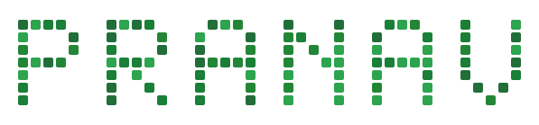

<picture>
  <source media="(prefers-color-scheme: dark)" srcset="./assets/pranav-dark.svg">
  <source media="(prefers-color-scheme: light)" srcset="./assets/pranav-light.svg">
  
</picture>

**Building AI-powered ideas into useful products.**

- 🤖 Exploring generative AI, agentic AI, and full-stack development
- 🤝 Open to hackathons, open source, and interesting collaborations
- 💬 Ask me about AI, C++, Java, DSA, Linux, and photography

**Tech:** Python · C++ · Java · TypeScript · React · Flutter

  <a href="https://instagram.com/vpranav_07">Instagram</a> ·
  <a href="https://linkedin.com/in/pranav-vudiga-5b6373384">LinkedIn</a> ·
  <a href="mailto:vudigapranav@gmail.com">Email</a>

